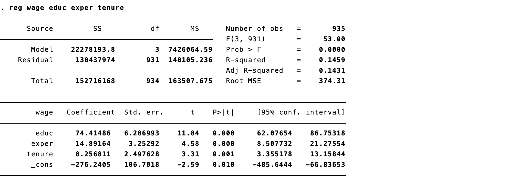

class: inverse, middle

```{r Setup, include = F}
options(htmltools.dir.version = FALSE)
library(pacman)
p_load(broom, latex2exp, ggplot2, ggthemes, ggforce, viridis, dplyr, magrittr, knitr, parallel, xaringanExtra, tidyverse, sjPlot, mathjaxr, ggforce, furrr, kableExtra, wooldridge, hrbrthemes, scales, ggeasy, patchwork, MetBrewer, stargazer, gapminder)


# Knitr options
opts_chunk$set(
  comment = "#>",
  fig.align = "center",
  fig.height = 7,
  fig.width = 10.5,
  warning = F,
  message = F,
  dpi=300
)

theme_set(theme_ipsum_rc())
```


# Motivation


---


# A critique

<br>

Here, we are dealing with the so-called .hi[frequentist] approach to Statistics/Econometrics.

--

It assumes that there exists an underlying .hi-orange[true population parameter] in nature.

--

<br><br>

Therefore, while this .hi[population parameter] value is fixed in nature, .hi-orange[samples] are variable.

--

And .hi[using samples] is the best we can do. 


---

# Where does this come from?

```{r, echo = F, dev = "svg", fig.height = 5.5}

min2 <- -3.5
max2 <- 3.5

c_values <- c(-1.9736, 0, 1.9736)


c_value <- 1.9736

labss <- as.character(c_values)

lab1 <- as.character(c_value)


ggplot(data.frame(x = c(min2, max2)), aes(x = x)) +
  stat_function(fun = dnorm, args = list(mean = 0, sd = 1), geom = "area", fill = "#8b9dc3", alpha = 0.35) +
  stat_function(fun = dnorm, args = list(mean = 0, sd = 1), size = 1.2, alpha = 0.8) +
  labs(x = "parameter space", y = "") +
  easy_x_axis_title_size(13)

```


---

layout: false
class: inverse, middle

# Confidence Intervals


---

# Confidence intervals

<br><br>

In practical terms, a regression returns a .hi[point estimate] of our desired parameter(s).

--

Supposedly, it .hi-orange[represents], to the best of our efforts, the "true" population parameter.

--

But wouldn't it be better if we could have a .hi[range] of values for $\beta_i$?

--

Given a .hi[confidence level] $(1-\alpha)$, we can easily construct a .hi-orange[confidence interval] for $\beta_i$.

---

# Confidence intervals

From .hi[Stats], we know:

--

$$ \text{CI} = \bar{x} \pm t_c \cdot \sigma $$
--

$$  \text{CI} = \bar{x} \pm t_c \cdot \frac{s}{\sqrt{n}}   $$
--


And now:

$$
\begin{aligned}
\text{CI} = \hat{\beta}_k \pm t_c \cdot SE(\hat{\beta}_k)
\end{aligned}
$$
--

where $t_c = t_{1-\alpha/2, \ n-k-1}$. 

<br>

It denotes the $1-\alpha/2$ .hi[quantile] of a *t* distribution, with *n-k-1* .hi[degrees-of-freedom].

---

# Confidence intervals

- The .hi-orange[standard error] (.hi-orange[*SE*]) of an estimate:

$$\mathop{\text{SE}} \left( \hat{\beta}_2 \right) = \sqrt{ \frac{s^2_u}{\sum_{i=1}^n (x_i - \bar{x})^2} }.$$
--

where $s^2_u = \dfrac{\sum_i \hat{u}_i^2}{n - k - 1}$ is the variance of $u_i$.

--

<br><br>

The standard error of an estimate is nothing but its .hi[standard deviation].


---

# Confidence intervals


- .hi[Informal interpretation:]

  - The confidence interval is a region in which we are able to place some .hi[trust] for containing the parameter of interest.

--

- .hi-orange[Formal interpretation:]

  - With .hi-orange[repeated sampling] from the population, we can construct confidence intervals for each of these samples. Then $(1-\alpha) \cdot100$ percent of our intervals (*e.g.,* 95%) will contain the population parameter _.hi[somewhere in this interval]_.

---

# Confidence intervals - An example

.center[
```{r, echo=FALSE, message=FALSE, warning=FALSE}

data("ceosal2")
data("wage2")


```

```{r, echo=FALSE}
sal_model <- lm(lsalary ~ age + lsales, data = ceosal2)
sal_model %>% 
  stargazer::stargazer(type = "text", no.space = TRUE)
```

]


---

# Confidence intervals - An example

<br>

From the previous regression output, we have:

  - $\hat{\beta}_{lsales_{i}}$: 0.225
  
  - $SE(\hat{\beta}_{lsales_{i}})$: 0.0277
  


<br>

In addition, the sample size (*n*) is 177.


---

# Confidence intervals - An example

- Then, we can calculate a 95% confidence interval for $\beta_{lsales_{i}}$:

$$ 
\begin{align}
\text{CI} =  \hat{\beta}_{lsales_{i}} \pm t_c \cdot SE(\hat{\beta}_{lsales_{i}})
\end{align}
$$
--

$$
\begin{align}
\text{CI} = 0.225 \ \pm \ t_{1-0.05/2, \ 177 - 2 - 1} \ \cdot \ 0.0277 
\end{align}
$$

--

$$
\begin{align}
\text{CI} = 0.225 \ \pm \ t_{1-0.05/2, \ 174} \ \cdot \ 0.0277 
\end{align}
$$

--

<br>

- $t_{1-0.05/2, \ 174} =$ `-1.973691`


- The interval is `[0.17, 0.28]`.

---

# Confidence intervals - An example

```{r, echo = F, dev = "svg", fig.height = 4}

min2 <- -3.5
max2 <- 3.5

c_values <- c(-1.9736, 0, 1.9736)


c_value <- 1.9736

labss <- as.character(c_values)

lab1 <- as.character(c_value)


ggplot(data.frame(x = c(min2, max2)), aes(x = x)) +
  stat_function(fun = dnorm, args = list(mean = 0, sd = 1), geom = "area", fill = "#8b9dc3", alpha = 0.35) +
  stat_function(fun = dnorm, args = list(mean = 0, sd = 1), size = 1.2, alpha = 0.8) +
  geom_area(stat = "function", fun = dnorm, args = list(mean = 0, sd = 1), 
            fill = "#cc79a7", xlim = c(1.9736, 3.5), alpha = 0.8) +
  geom_area(stat = "function", fun = dnorm, args = list(mean = 0, sd = 1), 
            fill = "#cc79a7", xlim = c(-1.9736, -3.5), alpha = 0.8) +
  labs(x = "t", y = "") +
  scale_x_continuous(breaks = c_values, labels = labss)


```

With .hi-orange[repeated sampling] from the population, 95% of our intervals will contain the population parameter _.hi[somewhere in this [0.17, 0.28] interval]_.


---

# Confidence intervals - An example

```{r, echo = F, dev = "svg", fig.height = 3}

min2 <- -3.5
max2 <- 3.5

c_values <- c(-2.625, 0, 2.625)


c_value <- 2.625

labss <- as.character(c_values)

lab1 <- as.character(c_value)


ggplot(data.frame(x = c(min2, max2)), aes(x = x)) +
  stat_function(fun = dnorm, args = list(mean = 0, sd = 1), geom = "area", fill = "#8b9dc3", alpha = 0.35) +
  stat_function(fun = dnorm, args = list(mean = 0, sd = 1), size = 1.2, alpha = 0.8) +
  geom_area(stat = "function", fun = dnorm, args = list(mean = 0, sd = 1), 
            fill = "#cc79a7", xlim = c(2.625, 3.5), alpha = 0.8) +
  geom_area(stat = "function", fun = dnorm, args = list(mean = 0, sd = 1), 
            fill = "#cc79a7", xlim = c(-2.625, -3.5), alpha = 0.8) +
  labs(x = "t", y = "") +
  scale_x_continuous(breaks = c_values, labels = labss)


```

- If we estimate a 99% confidence interval, we have:

$$
\begin{align}
\text{CI} = 0.225 \ \pm \ t_{1-0.01/2, \ 174} \ \cdot \ 0.0277 
\end{align}
$$

- $t_{1-0.01/2, \ 174} =$ `2.604379`
- The interval is `[0.15, 0.29]`.

---

layout: false
class: inverse, middle

# Hypothesis Testing

---

# Hypothesis testing

- When doing *hypothesis testing*, our aim is to determine whether there is enough .hi[statistical evidence] to reject a hypothesized value or range of values.

--

- In Econometrics, we usually run .hi-orange[two-sided (tailed)] tests about *regression parameters*.

  - $H_0: \beta_i = 0$
  - $H_a: \beta_i \neq 0$   

<br>

- The above testing procedure is a test of .hi[statistical significance].

  - If we .hi-orange[do not reject] $H_0$, the coefficient is not statistically significant.
  - If we .hi[reject] $H_0$, we have enough evidence to support the coefficient's  statistical significance.


---

# Hypothesis testing


In .mono[Stata]...




---

# Hypothesis testing

- Where does the `11.8` *t* value come from?

$$
\begin{align}
t = \dfrac{\hat{\beta}_k - \beta_{H_0}}{SE(\hat{\beta}_k)} = \dfrac{74.4 - 0}{6.29} = 11.8283
\end{align}
$$

<br><br>

--

- Where does the `4.58` *t* value come from?

$$
\begin{align}
t = \dfrac{\hat{\beta}_k - \beta_{H_0}}{SE(\hat{\beta}_k)} = \dfrac{14.9 - 0}{3.25} = 4.584615
\end{align}
$$


---

# Hypothesis testing


What are we supposed to do with these test statistics?

.pull-left[
- t.sub[educ] = `11.8`
- t.sub[exper] = `4.58`
- t.sub[tenure] = `3.31`
]

.pull-right[
- t.sub[critical value] = t.sub[.05/2, 931] = `1.962515`
]

```{r, echo = F, dev = "svg", fig.height = 3.5}

min2 <- -3.5
max2 <- 3.5

c_values <- c(-1.962, 0, 1.962)


c_value <- 1.962

labss <- as.character(c_values)

lab1 <- as.character(c_value)


ggplot(data.frame(x = c(min2, max2)), aes(x = x)) +
  stat_function(fun = dnorm, args = list(mean = 0, sd = 1), geom = "area", fill = "#8b9dc3", alpha = 0.35) +
  stat_function(fun = dnorm, args = list(mean = 0, sd = 1), size = 1.2, alpha = 0.8) +
  geom_area(stat = "function", fun = dnorm, args = list(mean = 0, sd = 1), 
            fill = "#cc79a7", xlim = c(1.962, 3.5), alpha = 0.8) +
  geom_area(stat = "function", fun = dnorm, args = list(mean = 0, sd = 1), 
            fill = "#cc79a7", xlim = c(-1.962, -3.5), alpha = 0.8) +
  labs(x = "t", y = "") +
  scale_x_continuous(breaks = c_values, labels = labss)


```


---

# Hypothesis testing

### Interpretation

<br>

At 5% of significance, we have enough evidence to .hi[reject the null hypothesis] that `educ` is not statistically significant.

At 5% of significance, we have enough evidence to .hi[reject the null hypothesis] that `exper` is not statistically significant.

At 5% of significance, we have enough evidence to .hi[reject the null hypothesis] that `tenure` is not statistically significant.

--

Therefore, all coefficients are (individually) .hi-orange[statistically significant].

---

# Hypothesis testing

## The F-test 

Sometimes, a coefficient on a .hi[specific variable] may not be *statistically significant*.

However, it may be of use in the .hi-orange[model's context].

Thus, a test of .hi[joint] significance is appropriate to evaluate whether .hi[all slope coefficients] are *jointly* significant within the model.

--

<br>

$$
\begin{align}
F = \dfrac{R^2_{\text{unr}} - R^2_{\text{rest}}}{1 - R^2_{\text{unr}}}\cdot \dfrac{(n-k-1)}{q} 
\end{align}
$$


---

# The F-test

Still with our .hi[wage] model: 

Suppose we want to test whether `educ` and `exper` are .hi-orange[jointly] significant.

--

For the purpose of this test, our previous model is the .hi[unrestricted] (full) model.

--

Then, we estimate a .hi-orange[restricted] model, excluding `educ` and `exper`.


  - Its R-squared is .b[0.0165]; while the unrestricted's is .b[0.146].
  
--

<br>

We have imposed .hi[2] restrictions to the full model. Thus, *q=2*.

--

And the .hi-orange[sample size] is *n=935*, which gives *n-k-1 = 931* for the full model.


---

# The F-test


$$
\begin{align}
F = \dfrac{R^2_{\text{unr}} - R^2_{\text{rest}}}{1 - R^2_{\text{unr}}}\cdot \dfrac{(n-k-1)}{q}  \\ \\ = \dfrac{0.146 - 0.0165}{1 - 0.146} \cdot \dfrac{935-3-1}{2} = 70.588
\end{align}
$$
--

- 70.588 is the .hi[test statistic] for the F-test

--

- Then, we compare the above value with the .hi-orange[critical values] given by the F-distribution table.

--

- Right-tail critical value:

  - $F_{1-.05/2, \ 2, \ 931}=$ 3.703535
  - Thus, we .hi[reject the null hypothesis], meaning that we have enough evidence to infer that `educ` and `exper` are .hi-orange[jointly significant] in this model.


---

layout: false
class: inverse, middle

# Next time: Inference in practice


---
exclude: true