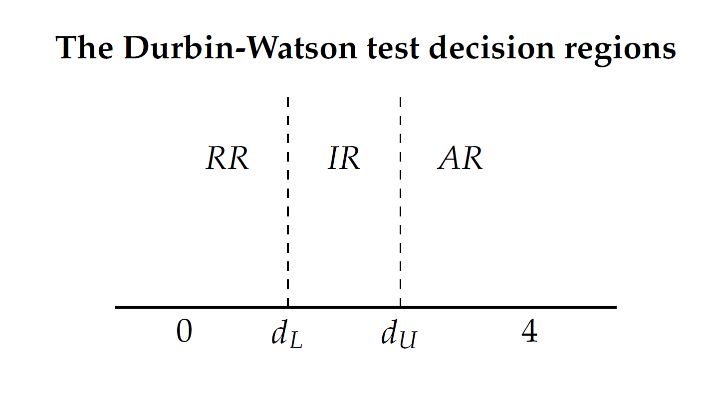

class: inverse, middle

```{r Setup, include = F}
options(htmltools.dir.version = FALSE)
library(pacman)
p_load(broom, latex2exp, ggplot2, ggthemes, ggforce, viridis, dplyr, magrittr, knitr, parallel, xaringanExtra, tidyverse, sjPlot, mathjaxr, ggforce, furrr, kableExtra, wooldridge, hrbrthemes, scales, ggeasy, patchwork, MetBrewer, stargazer, gapminder, lmtest, car)


# Knitr options
opts_chunk$set(
  comment = "#>",
  fig.align = "center",
  fig.height = 7,
  fig.width = 8,
  warning = F,
  message = F,
  dpi=300
)

theme_set(theme_ipsum_rc())
```

```{R, colors, include = F}
# Define pink color
red_pink <- "#e64173"
turquoise <- "#20B2AA"
orange <- "#FFA500"
red <- "#E02C05"
blue <- "#2b59c3"
green <- "#0FDA6D"
grey_light <- "grey70"
grey_mid <- "grey50"
grey_dark <- "grey20"
purple <- "#6A5ACD"
met_slate <- "#23373b" 
```


# Motivation


---

# The road so far

Over the past weeks, we have learned:

--

  - That .it[omitting] relevant variables from a model causes .hi[bias];
  
  - That deterministic/strong stochastic .it[linear relationships] between two independent variables harm regression .hi[standard errors], and, therefore, OLS .hi[inference].
  

--

<br>

This week and the next, we turn our attention to the .hi[residual] term, *u*.

--

  - We begin by investigating what happens when observations within *u* share some sort of .hi[linear relationship].
  
  - This problem is .it[extremely common] in time-series data, given that the .hi[order] of observations matters, which is not true for cross-section data.
  
  
  


---

layout: false
class: inverse, middle

# Pure serial correlation


---

# Pure serial correlation

Recall .hi[CLRM Assumption IV]:

> *"Observations of the error term are .it[uncorrelated] with each other."*
  
$$
\begin{align}
\mathbb{E}(r_{u_i,uj}) = 0 \hspace{1cm} \text{with } i \neq j    
\end{align}
$$

--

In a .hi[well-specified] model, autocorrelation can be characterized in the following way:


$$
\begin{align}
u_t = \rho u_{t-1} + e_t  
\end{align}
$$

<br>

where *&rho;* is known as the _.it[autocorrelation coefficient]_.

As *&rho; &rarr;* |1|, the higher the .it[degree] of serial correlation.

If *&rho; >* |1|, we have an .it[explosive] trajectory.

---

# Pure serial correlation

```{r, echo=FALSE, message=FALSE, warning=FALSE}

set.seed(6666)

gamma <- rnorm(100, mean=0, sd=1)
error <- rep(0,100)     ## 'error', for now, is a vector of 100 spots with 0 values.


#== We will define error's first observation as gamma's first obervation. The 
#== command is the following:

error[1] <- gamma[1]


#== Now, let us take care of the other 99 observations contained in 'error'. We will
#== do it using a 'for' loop function.

for(i in 2:100){
  error[i] <- 0.95 * error[i-1] + gamma[i]} 

```

```{r, echo=FALSE, dev="svg", fig.height=5.5, fig.width = 10}
library(ggfortify)

error <- ts(error, start=c(1990,1), freq=12)

p1 <- autoplot(error) + labs(title="p = 0.95", y=expression(u[t]))

for(i in 2:100){
  error[i] <- -1.2 * error[i-1] + gamma[i]} 

error <- ts(error, start=c(1990,1), freq=12)

p2 <- autoplot(error) + labs(title="p = -1.2", y=expression(u[t]))


p1 / p2


```


---

layout: false
class: inverse, middle

# Impure serial correlation


---

# Impure serial correlation

The .hi["impure"] version of serial correlation occurs in .it[misspecified models].

--

Whenever the error term contains a relevant variable that has been omitted from the model, which in turn is .hi[serially correlated] itself, we have a case of impure serial correlation.

--

<br>

- A simple .it[example]: suppose we are interested in a person's wealth over time. In case we omit their .it[credit score] measure, for instance, it will be part of the error term.

  - Do you believe one's credit score .it[today] is dependent on their .it[last year's] credit score?
  
  - If you .it[do], then this omitted variable is affecting the error term, thus causing serial correlation, even if the error term, .it[by itself], is not serially correlated.
  
---

# Impure serial correlation

Recall what happens when we omit a relevant variable from a model:

--

  - Suppose we have the .it["true"] population model:
  

$$
\begin{align}
y_t = \beta_0 + \beta_1x_{1t} + \beta_2x_{2t} + u_t  
\end{align}
$$ 
--

  - And instead we estimate:
  
$$
\begin{align}
y_t = \beta_0 + \beta_1x_{1t} + u_t^* 
\end{align}
$$ 

with $u_t^* = u_t + \beta_2x_{2t}$.

--

<br>

In case $x_2$ is .it[serially correlated], it will affect the residual term, which in turn .it[will be] serially correlated.

---


layout: false
class: inverse, middle

# Consequences of serial correlation


---

# Consequences of serial correlation

Firstly, autocorrelation .hi[does not] cause .hi[bias] to OLS estimates.

--

However, it affects OLS .hi[standard errors], undermining .hi[inference] from OLS models.

--

  - Since it usually .hi[underestimates] SEs, we end up being .it[more likely] to .it[reject] null hypotheses, increasing the likelihood of .it[Type I error].

--

<br>

This way, OLS is no longer .hi-blue[BLUE].

--

  - Why? Its .hi-blue[B] part is affected.
  
  - .hi-blue["Best"] refers to .hi-blue[minimum variance], which is not achieved with serial correlation.


---


layout: false
class: inverse, middle

# Dealing with serial correlation

---

# Dealing with serial correlation

<br><br>

In addition to .hi[visualizing] OLS residuals, there are several .hi[tests] for serial correlation.

--

The most common ones are the .hi[Durbin-Watson] and .hi-orange[Breusch-Godfrey] tests.

--

<br>

Moreover, we can use the .hi-orange[Cochrane-Orcutt] estimator to correct for serial correlation.

--

We will study these procedures through an .hi[applied example].


---

# Okun's law

.hi[Okun's law] illustrates the relationship between .hi-orange[unemployment] and .hi-orange[growth] in an economy over time.

--

In a very .it[basic] form, it can be expressed as follows:

<br>

$$
\begin{align}
u_t - u_{t-1} = -\gamma (g_t - g_n)
\end{align}
$$

<br>

 - where $u_t$ and $u_{t-1}$ are the unemployment rate at time $t$ and $t-1$, respectively;
 - $g_t$ is the output growth rate at time $t$, and $g_n$ is the "normal" output growth rate, which can be assumed as constant.
 - The $\gamma$ coefficient measures this relationship. If the growth of output is *above* the normal rate, unemployment falls; a growth rate *below* the normal rate leads to an increase in unemployment.

---

# Okun's law

<br>

We can rewrite Okun's law as:

$$
\begin{align}
\Delta u_t = -\gamma \ g_t
\end{align}
$$ 
where $\Delta u_t$ denotes the .it[change] in unemployment from $t-1$ to $t$.

--

<br>

As an .it[econometric model], we can write it as follows:

$$
\begin{align}
\Delta u_t = \beta_0 + \beta_1g_t + \varepsilon_i
\end{align}
$$ 

--

Let's throw some .it[data] in!

---

# Okun's law: data for Australia (1978Q2&mdash;2016Q2):


```{r, echo=FALSE, message=FALSE, warning=FALSE}

library(orcutt)
library(lubridate)
library(tsibble)
library(ggfortify)
library(dynlm)
library(lmtest)
library(patchwork)

okun <- read_csv('okun.csv')
okun <- okun %>% as_tibble()
okun <- okun %>% mutate(date = seq(as.Date("1978/4/1"), as.Date("2016/4/1"), by="quarter"))

okun_data <- okun %>% as_tsibble(index=date)
okun_data <- okun_data %>% select(date, g, u)
okun_data <- okun_data %>% mutate(du = u - lag(u))


```


```{r, echo=FALSE, dev = "svg", fig.height=5.5, fig.width=10}

g1 <- okun_data %>% ggplot(aes(x=date, y=du)) + geom_line(color=red_pink) + 
  scale_x_yearquarter() + geom_point(color=red_pink) +
  labs(x='', y='Change in unemployment') +
  easy_y_axis_title_size(13)

g2 <- okun_data %>% ggplot(aes(x=date, y=g)) + geom_line(color=blue) + 
  scale_x_yearquarter() + geom_point(color=blue) +
  labs(x='', y='Output growth') +
  easy_y_axis_title_size(13)


g1 / g2


```


---

# Okun's law

A quick check at the model's .hi[residuals]:

```{r, echo=FALSE, dev = "svg", fig.height=4.5, fig.width=9}

okun_model <- lm(du ~ g, data = okun_data)


okun_resid <- okun_model %>% resid()


okun_data <- okun_data %>% 
  mutate(okun_resid = c(NA, okun_resid))


okun_data %>% 
  ggplot(aes(x = date, y = okun_resid)) +
  geom_line() +
  scale_x_yearquarter() + labs(y=expression(e[t]), x = "") +
  easy_y_axis_title_size(13)

```

--

Does it look .hi-blue[autocorrelated]?

---

# The Durbin-Watson test

The .hi-orange[Durbin-Watson] test for autocorrelation is used to test for .hi[first-degree] serial correlation.

--

Provided that the regression model contains an .it[intercept] term $(\beta_0)$ and has .it[no lagged] independent variable $(e.g., x_{1,\ t-1})$, this test can be implemented.


$$
\begin{align}
d = \sum_{t=2}^{T}(\varepsilon_t-\varepsilon_{t-1})^2 \bigg/  \sum_{t=1}^{T}(\varepsilon_t)^2
\end{align}
$$ 

with $0 \le d \le 4$.

--

<br>

It can be .it[approximated] by $2(1-\hat{\rho})$.

😌


---

# The Durbin-Watson test

<br>

The .hi[recipe] `r emo::ji("woman_cook")` `r emo::ji("man_cook")`:

<br>

.pseudocode-small[

1. Estimate the regression model via OLS, storing its residuals;

2. Calculate the $d$ test statistic;

3. Based on k, the number of slope coefficients, and on n, the sample size, consult the DW table for critical values.

4. The test’s null hypothesis is of no serial correlation in the residuals. In case we reject *H<sub>0</sub>*, we
have evidence of serial correlation.


]

---

# The Durbin-Watson test

```{r}
okun_model %>% 
  dwtest()
```


.center[]


---

# The Durbin-Watson test

```{}
. estat dwatson

Durbin–Watson d-statistic(  2,   152) =  1.330972

```

<br>

.center[]


---

# The Breusch-Godfrey test

The .hi[Breusch-Godfrey] test follows a similar procedure as the Durbin-Watson test's.

--

Its main .it[difference] involves the .hi[auxiliary regression] estimated to find the autocorrelation coefficient, $\rho$. It must also include all .hi-orange[independent variables] from the original model.

<br>

--


$$
\begin{align}
LM = (n-q)R^2_{\hat{\varepsilon}}
\end{align}
$$

<br>

where $n$ is the sample size from the original regression model; 

$q$ is the order of autocorrelation we wish to test for;

and $R^2_{\hat{\varepsilon}}$ is the coefficient of determination from the auxiliary regression.

---

# The Breusch-Godfrey test


```{r}
okun_model %>% 
  bgtest(order = 1, fill = NA)
```

<br><br>

What is our .it[inference]?


---

# The Breusch-Godfrey test


```{}
. estat bgodfrey, lag(1) nomiss0

Breusch–Godfrey LM test for autocorrelation
---------------------------------------------------------------------------
    lags(p)  |          chi2               df                 Prob > chi2
-------------+-------------------------------------------------------------
       1     |         18.154               1                   0.0000
---------------------------------------------------------------------------
                        H0: no serial correlation

```

<br><br>

What is our .it[inference]?


---

# The Cochrane-Orcutt estimator

<br><br>

From the two previous tests, we can infer that our Okun's law model suffers from .it[serial correlation].

--

So what do we do?

--

The .hi[Cochrane-Orcutt] procedure allows for the estimation of a .it[modified] version of the original regression model, allowing for serially .it[uncorelated] residuals.


---

# The Cochrane-Orcutt estimator

<br>

The .hi[recipe] `r emo::ji("woman_cook")` `r emo::ji("man_cook")`:

.pseudocode-small[

1. Estimate the regression model via OLS, storing its residuals;

2. Estimate a first-order Markov scheme for $\hat{u}_t$, storing $\hat{\rho}$;

3. Transform the variables from the original regression into *quasi-differenced* terms, using $\hat{\rho}$;

4. Re-estimate the model via OLS using the quasi-differenced variables from step 4.


]

---

# The Cochrane-Orcutt estimator

.pseudocode-small[

Step 3: Transform the variables from the original regression into *quasi-differenced* terms, using $\hat{\rho}$.


]

--

For our Okun's law model, we have:

$$
\begin{align}
\tilde{g}_t = g_t - \hat{\rho}g_{t-1}
\end{align}
$$ 

$$
\begin{align}
\widetilde{\Delta u}_t = \Delta u_t - \hat{\rho}\Delta u_{t-1}
\end{align}
$$ 
--

<br>

.pseudocode-small[

Step 4: Re-estimate the model via OLS using the quasi-differenced variables from step 4.


]

$$
\begin{align}
\widetilde{\Delta u}_t = \tilde{\beta}_0 + \beta_1\tilde{g}_t + e_t
\end{align}
$$ 

where $\tilde{\beta}_0 = (1-\hat{\rho})\beta_0$.

---

# The Cochrane-Orcutt estimator

```{r}
library(orcutt)

summary(cochrane.orcutt(okun_model))
```


--

So what?


---

# The Cochrane-Orcutt estimator

```{}
. prais du g, corc

Cochrane–Orcutt AR(1) regression with iterated estimates

      Source |       SS           df       MS      Number of obs   =       151
-------------+----------------------------------   F(1, 149)       =      0.19
       Model |    .0124954         1    .0124954   Prob > F        =    0.6622
    Residual |  9.71553772       149  .065204951   R-squared       =    0.0013
-------------+----------------------------------   Adj R-squared   =   -0.0054
       Total |  9.72803312       150  .064853554   Root MSE        =    .25535

------------------------------------------------------------------------------
          du | Coefficient  Std. err.      t    P>|t|     [95% conf. interval]
-------------+----------------------------------------------------------------
           g |   -.010738   .0245295    -0.44   0.662    -.0592086    .0377326
       _cons |   .0035386   .0510639     0.07   0.945    -.0973644    .1044416
-------------+----------------------------------------------------------------
         rho |   .5612189
------------------------------------------------------------------------------
Durbin–Watson statistic (original)    = 1.330972
Durbin–Watson statistic (transformed) = 2.270438


```

.smaller[So what?]
---

# The Cochrane-Orcutt estimator

Now, the residuals from the .hi-blue[Cochrane-Orcutt] procedure:


```{r, echo=FALSE, dev = "svg", fig.height=5}
co <- cochrane.orcutt(okun_model)

co_resid <- co$residuals

okun_data <- okun_data %>% 
  mutate(co_resid = c(NA, co_resid))


okun_data %>% 
  ggplot(aes(x = date, y = co_resid)) +
  geom_line() +
  scale_x_yearquarter() +  labs(y=expression(e[t]), x = "")
```


---

layout: false
class: inverse, middle

# Next time: Serial correlation in practice


---
exclude: true

